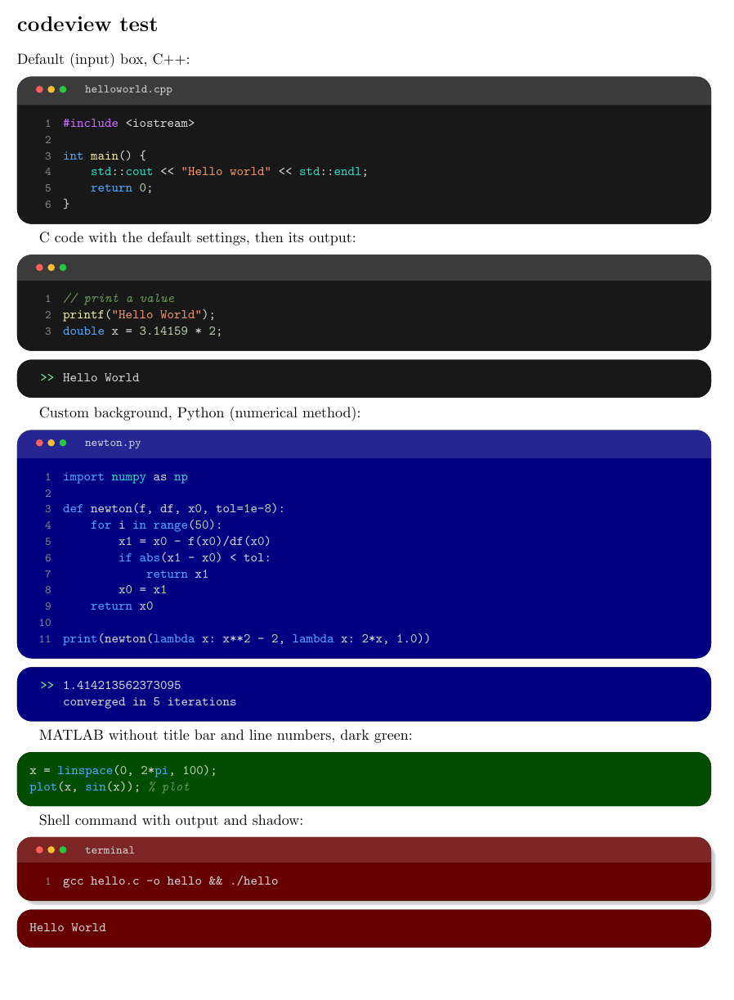

# codeview

**IDE-style code and shell-output boxes for LaTeX** — built for lecture notes, textbooks and Beamer slides.

`codeview` gives you two environments-in-one: an **input** box that looks like a code editor window (title bar with window buttons, line numbers, automatic syntax colouring) and an **output** box that looks like a terminal (`>> result`). Perfect for showing a numerical-methods program together with what it prints.



```latex
\begin{codeview}[input, name=helloworld.cpp]
#include <iostream>

int main() {
    std::cout << "Hello world" << std::endl;
}
\end{codeview}

\begin{codeview}[output]
Hello world
\end{codeview}
```

---

## Table of contents

1. [Features](#features)
2. [Requirements](#requirements)
3. [Installation](#installation)
4. [Quick start](#quick-start)
5. [Options reference](#options-reference)
6. [Supported languages](#supported-languages)
7. [Examples](#examples)
8. [Using it with each document class](#using-it-with-each-document-class)
9. [Customisation](#customisation)
10. [Known limitations](#known-limitations)
11. [Troubleshooting](#troubleshooting)
12. [How it works](#how-it-works)
13. [Repository contents](#repository-contents)
14. [Contributing](#contributing)
15. [License](#license)

---

## Features

- **One environment, two modes:** `\begin{codeview}[input]` for code and `\begin{codeview}[output]` for results.
- **Automatic syntax highlighting** with an editor-like dark palette: keywords, preprocessor directives, strings, comments, numbers, functions and library names each get their own colour. No manual colouring is needed.
- **Window-style title bar** with the three red/yellow/green buttons and an optional file name (`name=euler.cpp`).
- **Line numbers** on input boxes (can be turned off).
- **Shell-like output:** a green `>>` prompt in front of the output, in `all` lines, `first` line only, or `none` mode.
- **Changeable background:** `bg=blue!50!black` or any xcolor expression. The title bar shade follows automatically. The default is near-black.
- **Works in** `article`, `report`, `book`, `beamer` and `standalone`.
- **No `-shell-escape`**, no Python and no external tools needed. It is built on `tcolorbox` and `listings`.
- **Every `tcolorbox` key also works** (`width=`, `colframe=`, `arc=`, and so on).

---

## Requirements

| Requirement | Notes |
|---|---|
| A LaTeX distribution | TeX Live or MiKTeX (any recent version) |
| `tcolorbox` (with libraries `listings`, `skins`) | loaded automatically with `[most]` |
| `listings` | syntax highlighting engine |
| `xcolor`, `tikz` | colours and the window-button dots |

All of these ship with a standard TeX Live / MiKTeX installation, and Overleaf has them by default.

The package was developed and tested with **pdfLaTeX** on the `article`, `beamer` and `standalone` classes. `report` and `book` don't depend on anything special, so they should behave like `article`. LuaLaTeX and XeLaTeX should also work but haven't been tested by the author.

---

## Installation

### Option 1 — Local copy (simplest, works everywhere including Overleaf)

Put `codeview.sty` in the same folder as your `.tex` file:

```
my-notes/
├── main.tex
└── codeview.sty
```

On Overleaf, upload `codeview.sty` to your project.

### Option 2 — Install for all your documents

Copy `codeview.sty` into your local texmf tree and refresh the file database.

**Linux / macOS (TeX Live):**

```bash
mkdir -p ~/texmf/tex/latex/codeview
cp codeview.sty ~/texmf/tex/latex/codeview/
texhash ~/texmf
```

**Windows (MiKTeX):** copy the file into a folder such as `C:\Users\<you>\texmf\tex\latex\codeview\`, add that root folder in *MiKTeX Console → Settings → Directories*, then click *Refresh FNDB*.

Then in your preamble:

```latex
\usepackage{codeview}
```

---

## Quick start

```latex
\documentclass{article}
\usepackage{codeview}

\begin{document}

\begin{codeview}[input]
printf("Hello World");
\end{codeview}

\begin{codeview}[output]
Hello World
\end{codeview}

\end{document}
```

Compile with `pdflatex main.tex`. That is all.

If you don't write `input` or `output`, the box is an **input** box.

> **Important:** the closing `\end{codeview}` must be on a line of its own, and the body is copied verbatim (like the `verbatim` environment), so don't indent `\end{codeview}` inside other constructs that need it.

---

## Options reference

Options go in the optional argument, separated by commas:

```latex
\begin{codeview}[input, lang=Python, name=newton.py, bg=blue!50!black]
```

Write the box type (`input` / `output`) **first**. It sets defaults that the later keys then adjust.

### Box type

| Key | Effect |
|---|---|
| `input` | Editor-style box: title bar with window buttons, line numbers, syntax colours. **Default.** |
| `output` | Terminal-style box: no title bar, `>>` prompt, plain light text. |

### Appearance

| Key | Values | Default | Description |
|---|---|---|---|
| `bg` | any xcolor expression | near-black (`#181818`) | Background of the box. The title bar is automatically a slightly lighter version of it. Examples: `bg=blue!50!black`, `bg=green!30!black`, `bg={rgb,255:red,30;green,30;blue,46}`. |
| `fontsize` | a size macro | `\small` | Font size of the code, e.g. `fontsize=\footnotesize`, `fontsize=\normalsize`. |
| `shadow` | — | off | Adds a soft drop shadow. |
| `width` | a length | `\linewidth` | Passed straight to tcolorbox, e.g. `width=0.8\linewidth`, `width=6cm`. |

### Code settings (input boxes)

| Key | Values | Default | Description |
|---|---|---|---|
| `lang` | a listings language | `C++` | Language used for highlighting. Dialects need braces: `lang={[95]Fortran}`. See [Supported languages](#supported-languages). |
| `name` | text | none | File name shown in the title bar, e.g. `name=euler.cpp`. Setting it turns the title bar on. |
| `nodots` | — | — | Hides the three window buttons (keeps the bar if `name` is set; otherwise removes the bar). |
| `dots` | — | on for input | Shows the window buttons (useful on an output box). |
| `titlebar` / `notitlebar` | — | bar on for input, off for output | Force the title bar on or off. |
| `linenos` / `nolinenos` | — | line numbers on for input | Toggle line numbers. |

### Output settings

| Key | Values | Default | Description |
|---|---|---|---|
| `prompt` | `all`, `first`, `none` | `all` | `all`: `>>` before every line. `first`: `>>` only before the first line (like a command followed by its result). `none`: no prompt at all. |
| `promptsymbol` | text | `>>` | The prompt string, e.g. `promptsymbol={\$}` or `promptsymbol={In [1]:}`. |

### Any tcolorbox key

Anything else you pass is handed to `tcolorbox`, so you can also use `colframe=...`, `boxrule=...`, `arc=...`, `left=...`, `top=...`, `before skip=...`, and so on. See the [tcolorbox manual](https://ctan.org/pkg/tcolorbox).

---

## Supported languages

Highlighting is done by [`listings`](https://ctan.org/pkg/listings), so `lang=` accepts any language it knows. The ones most useful for numerical methods and scientific computing:

| Language | `lang=` value |
|---|---|
| C++ | `C++` *(default)* |
| C | `C` or `{[ANSI]C}` |
| Python | `Python` |
| Fortran | `{[95]Fortran}` (also `{[77]Fortran}`, `{[03]Fortran}`, `{[08]Fortran}`) |
| MATLAB | `Matlab` |
| GNU Octave | `Octave` |
| Bash / shell scripts | `bash` |
| Java | `Java` |
| R | `R` |
| Julia | not built in to listings — see [Known limitations](#known-limitations) |

Notes:

- **Fortran and other dialects** need braces around `[dialect]Language`, otherwise LaTeX will throw an error.
- Language names are case-insensitive.
- The full list is in the listings manual (`texdoc listings`, section *Languages*).

In addition to the language keywords, the package colours a built-in list of common numerical names (for example `printf`, `print`, `sqrt`, `linspace`, `zeros`, `plot`, `np`, `std`, `cout`, `endl`) in the "function" and "library" colours. You can extend this list — see [Customisation](#customisation).

---

## Examples

### C++ with a file name

```latex
\begin{codeview}[input, name=euler.cpp]
#include <iostream>
#include <cmath>

// forward Euler for y' = -2y
int main() {
    double y = 1.0, h = 0.1;
    for (int i = 0; i < 10; ++i)
        y += h * (-2.0 * y);
    std::cout << "y = " << y << std::endl;
}
\end{codeview}
```

### Python

```latex
\begin{codeview}[input, lang=Python, name=newton.py]
def newton(f, df, x0, tol=1e-8):
    for i in range(50):
        x1 = x0 - f(x0)/df(x0)
        if abs(x1 - x0) < tol:
            return x1
        x0 = x1
    return x0
\end{codeview}
```

### Fortran 90

```latex
\begin{codeview}[input, lang={[95]Fortran}, name=euler.f90]
program euler
  implicit none
  real(8) :: y, h
  integer :: i
  y = 1.0d0; h = 0.1d0
  do i = 1, 10
     y = y + h * (-2.0d0 * y)
  end do
  print *, "y = ", y
end program euler
\end{codeview}
```

### Output with the default prompt

```latex
\begin{codeview}[output]
y = 0.107374
\end{codeview}
```

Renders as `>> y = 0.107374`.

### Multi-line output, prompt only on the first line

```latex
\begin{codeview}[output, prompt=first]
1.414213562373095
converged in 5 iterations
\end{codeview}
```

### Custom background colour

```latex
\begin{codeview}[input, lang=Python, bg=blue!50!black]
print("dark blue theme")
\end{codeview}

\begin{codeview}[output, bg=blue!50!black]
dark blue theme
\end{codeview}
```

Use the same `bg` on an input box and its matching output box to make them look like one session.

### Minimal box: no title bar, no line numbers

```latex
\begin{codeview}[input, lang=Matlab, nodots, nolinenos]
x = linspace(0, 2*pi, 100);
plot(x, sin(x));
\end{codeview}
```

### A shell session with a custom prompt

```latex
\begin{codeview}[input, lang=bash, name=terminal, shadow]
gcc hello.c -o hello && ./hello
\end{codeview}

\begin{codeview}[output, prompt=none]
Hello World
\end{codeview}
```

### Narrower box with a smaller font

```latex
\begin{codeview}[input, width=0.7\linewidth, fontsize=\footnotesize]
...
\end{codeview}
```

The file `test.tex` in this repository contains a complete, compilable set of examples.

---

## Using it with each document class

### `article`, `report`, `book`

Nothing special — load the package and use the environment anywhere in the body.

### `beamer`

Frames that contain verbatim-style content must be marked **fragile**:

```latex
\documentclass{beamer}
\usepackage{codeview}

\begin{document}

\begin{frame}[fragile]{Forward Euler}
  \begin{codeview}[input, lang=Python, name=euler.py, fontsize=\footnotesize]
y, h = 1.0, 0.1
for i in range(10):
    y += h * (-2.0 * y)
  \end{codeview}
  \begin{codeview}[output]
0.107374
  \end{codeview}
\end{frame}

\end{document}
```

Tips:

- Use `fontsize=\footnotesize` (or `\scriptsize`) for longer listings so they fit on a slide.
- Overlay specifications (`\only<2>{...}`, `<2->`) around a `codeview` box are **not** supported because the content is verbatim. Use separate frames or `\pause` between boxes instead.

### `standalone`

The `standalone` class has no natural text width, so give the box an explicit width:

```latex
\documentclass[border=5pt]{standalone}
\usepackage{codeview}
\begin{document}
\begin{codeview}[output, width=6cm]
Hello World
\end{codeview}
\end{document}
```

This is handy for producing a box as a stand-alone PDF or image to include in other documents.

---

## Customisation

### Change the colours

All colours are ordinary xcolor colours. Redefine any of them **after** loading the package:

```latex
\usepackage{codeview}
\definecolor{cvkeyword}{HTML}{FF7B72}
\definecolor{cvstring}{HTML}{A5D6FF}
```

| Colour name | Default | Used for |
|---|---|---|
| `cvbg` | `#181818` | default background |
| `cvfg` | `#D4D4D4` | normal text |
| `cvkeyword` | `#4FA8FF` | keywords (`int`, `for`, `def`, `do`) |
| `cvdirective` | `#C86BFF` | preprocessor directives (`#include`) |
| `cvstring` | `#F0916B` | strings |
| `cvcomment` | `#6A9955` | comments (italic) |
| `cvfunction` | `#E8E8A0` | functions (`main`, `printf`, `print`, …) |
| `cvtype` | `#2FD8C0` | library names (`std`, `cout`, `np`, …) |
| `cvnumber` | `#B5CEA8` | numbers |
| `cvlineno` | `#858585` | line numbers and file name |
| `cvprompt` | `#7EE787` | the `>>` prompt |
| `cvdot@r`, `cvdot@y`, `cvdot@g` | `#FF5F57`, `#FEBC2E`, `#28C840` | window buttons |

Because `cvbg` is the default background, `\definecolor{cvbg}{HTML}{1E1E2E}` changes it for the whole document, while `bg=` changes it for one box only.

### Colour more function or library names

Function and library names are highlighted from lists in the style definition `cvinput` inside `codeview.sty`:

```latex
emph={std,cout,cin,...},          % library-style names  → cvtype colour
emph={[2]main,printf,print,...},  % function names       → cvfunction colour
```

To add your own names, copy `codeview.sty` into your project and add them to those lists.

### Default box size and spacing

Pass tcolorbox keys per box, or set them for the whole document with `\tcbset` (which applies to all tcolorbox environments):

```latex
\tcbset{arc=1mm}   % less rounded corners everywhere
```

---

## Known limitations

- **Verbatim content:** the code is read verbatim, so `codeview` cannot be placed inside the argument of another command (for example `\footnote{...}`, `\fbox{...}`, or a Beamer overlay command). Put it directly in the document body or in a `fragile` frame.
- **Highlighting is `listings`-based, not a full parser:**
  - Functions are coloured from a name list, not detected automatically. A function that isn't in the list appears in the normal text colour (its parentheses are unaffected).
  - Python decorators and the inside of f-string braces are not treated specially.
  - Numbers are coloured by simple character substitution, so digits inside identifiers (like `x1`) may occasionally be coloured.
  - Very new language keywords may be missing (for example some modern Fortran keywords).
- **Languages not in `listings`:** Julia, Rust, Go and others aren't built in. You can define them with `\lstdefinelanguage` (see the listings manual) and then use `lang=YourLanguage`.
- **Page breaks:** boxes are kept in one piece and are not split over two pages. Split very long listings into several boxes.
- **Unicode:** with pdfLaTeX, `listings` doesn't handle UTF-8 characters such as `≤`, `→` or accented letters inside code. Keep code to ASCII, or use LuaLaTeX/XeLaTeX and check the result.
- **Temporary file:** tcolorbox writes a `<jobname>.listing` temporary file next to your document. It is harmless and can be deleted.

---

## Troubleshooting

| Problem | Cause and fix |
|---|---|
| `File ended while scanning use of \lstKV@OptArg@@` | You passed a language dialect without braces. Write `lang={[95]Fortran}` (not `lang=[95]Fortran`). |
| `Package keyval Error: ... undefined` | Usually a misspelt key. Check the [options reference](#options-reference). |
| `Runaway argument` / `\end{codeview}` not found | `\end{codeview}` has to be on its own line, and the environment must not be inside another command's argument. |
| Beamer error such as `File ended while scanning use of \next` | Add `[fragile]` to the frame: `\begin{frame}[fragile]`. |
| Box is far too narrow or too wide in `standalone` | Add `width=<length>`, for example `width=8cm`. |
| Code is clipped or overflows | Lines wrap automatically, but very long unbroken tokens can overflow. Use `fontsize=\footnotesize`, a narrower box, or shorter lines. |
| Line numbers overlap the code | Only happens with a huge font size. Reduce `fontsize` or use `nolinenos`. |
| Colours are wrong or missing for a language | Check the `lang=` spelling. For an unknown language listings shows plain text. |
| `Undefined control sequence` when using `\definecolor` | Put your `\definecolor` lines **after** `\usepackage{codeview}` (or `\usepackage{xcolor}` before them). |

---

## How it works

`codeview` is a small wrapper around two well-established packages:

- **`tcolorbox`** (with its `listings` and `skins` libraries) draws the rounded coloured box and the title bar, and provides the `\newtcblisting` mechanism for verbatim content.
- **`listings`** does the syntax highlighting. The package defines two listings styles: `cvinput` (coloured) and `cvoutput` (plain).
- The three window buttons are tiny TikZ circles placed in the box title.
- The output prompt is created by re-using the listings **line-number** column, styled to print `>>` (or your custom `promptsymbol`) instead of a number. That is why the prompt stays neatly aligned even when long lines wrap.
- The options `input`, `output`, `bg`, `lang`, `name`, … are implemented as custom tcolorbox keys, which is why any normal tcolorbox key can be mixed in the same option list.

The environment is defined in one line at the bottom of `codeview.sty`:

```latex
\newtcblisting{codeview}[1][]{cv@base, ..., input, #1}
```

so every box starts as an `input` box and your options are applied on top.

---

## Repository contents

```
.
├── codeview.sty   # the package
├── test.tex       # example document exercising all features
├── test.pdf       # compiled output of test.tex
├── preview.png    # screenshot used in this README
└── README.md
```

To try it out:

```bash
pdflatex test.tex
```

---

## Contributing

Bug reports, ideas and pull requests are welcome. If you report a problem, please include:

- your LaTeX engine and distribution (e.g. pdfLaTeX / TeX Live 2025),
- the document class,
- a minimal `.tex` file that reproduces it.

Ideas that would be nice to have: more built-in function lists per language, a `minted` backend for richer highlighting, breakable boxes, and ready-made colour themes (light theme, Solarized, Dracula, …).

---

## License

Released under the **MIT License** — you are free to use, copy, modify and distribute this package, including in commercial and academic material. Add a `LICENSE` file with your name and the year to your repository.
